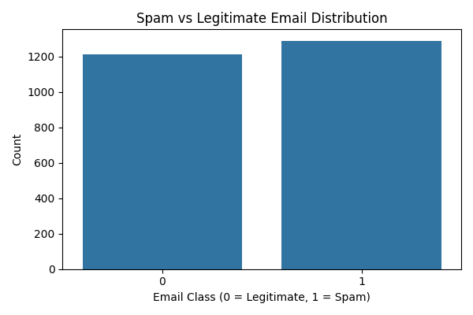
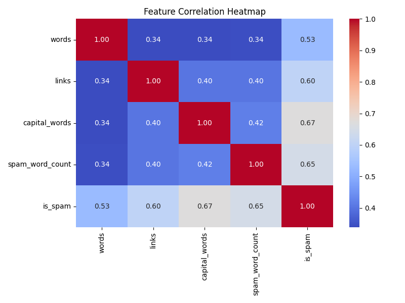

# Email Spam Classification with Logistic Regression

This Python console application classifies emails as **spam** or **legitimate** using a logistic regression model trained on a dataset of email features.

---

## Dataset

The dataset used is [`g_sharabidze2024_938274.csv`](https://github.com/sharaba22/AI_and_ML_MIDTERM/blob/main/Spam_email_detection/g_sharabidze2024_938274.csv), which contains the following features:

- `words`: total word count in the email
- `links`: number of links (e.g., "http", "www")
- `capital_words`: number of fully capitalized words
- `spam_word_count`: number of spammy keywords (e.g., "free", "win", "money")
- `is_spam`: target label (1 = spam, 0 = legitimate)

Note: click name of the file to view the dataset on GitHub.

---

## Model Training

### Step 1: Load and preprocess the data
```python
data = pd.read_csv("g_sharabidze2024_938274.csv")
X = data[["words", "links", "capital_words", "spam_word_count"]]
y = data["is_spam"]
```

### Step 2: Split into training and testing sets

```python
X_train, X_test, y_train, y_test = train_test_split(X, y, test_size=0.3, random_state=42)
```

### Step 3: Train logistic regression model

```python
model = LogisticRegression(max_iter=1000)
model.fit(X_train, y_train)
```

### Step 4: Print model coefficients

```python
for feature, coef in zip(X.columns, model.coef_[0]):
    print(f"{feature}: {coef:.4f}")
```
---
## Model Evaluation

### Step 5: Predict and evaluate

```python
y_pred = model.predict(X_test)
conf_matrix = confusion_matrix(y_test, y_pred)
accuracy = accuracy_score(y_test, y_pred)
```

## Confusion Matrix
The confusion matrix summarizes the model's classification results:

```python
[[TN FP]

[FN TP]]
```

- TN (True Negatives): Legitimate emails correctly classified as legitimate
- FP (False Positives): Legitimate emails incorrectly classified as spam
- FN (False Negatives): Spam emails incorrectly classified as legitimate
- TP (True Positives): Spam emails correctly classified as spam

Example output:
```python
[[105  10]

[  7 128]]
```

## Accuracy
Accuracy measures the proportion of correctly classified emails out of all predictions:

```python
accuracy = accuracy_score(y_test, y_pred)
print(f"Accuracy: {accuracy:.2%}")
```
Example output:
```python
Accuracy: 94.13%
```
---
## Email Text Classification

### Step 6: Feature extraction from raw email

```python
def extract_features(email_text):
    words = len(email_text.split())
    links = email_text.lower().count("http") + email_text.lower().count("www")
    capital_words = sum(1 for word in email_text.split() if word.isupper())
    spammy_words = ["free", "win", "money", "offer", "urgent", "click"]
    spam_word_count = sum(email_text.lower().count(word) for word in spammy_words)
    return pd.DataFrame([[words, links, capital_words, spam_word_count]], columns=X.columns)

```

### Step 7: Classify new email

```python
def classify_email(email_text):
    features = extract_features(email_text)
    prediction = model.predict(features)[0]
    label = "Spam" if prediction == 1 else "Legitimate"
    print(f"Email Classification: {label}")

```

---
## Sample Emails

### Spam Email

`URGENT! Click here to WIN free money now! Visit http://spam.com for your offer.`

- Contains spammy keywords and a link
- Classified as Spam

### Legitimate Email

`Dear team, please find attached the report for Q3. Let me know if you have any questions.`

- Professional tone, no spammy words or links
- Classified as Legitimate

---

## Visualizations

### Spam vs Legitimate Distribution

```python
sns.countplot(x="is_spam", data=data)
```

- Shows class balance in the dataset


### Feature Correlation Heatmap

```python
sns.heatmap(data.corr(), annot=True, cmap="coolwarm")
```



- Reveals relationships between features and target label
